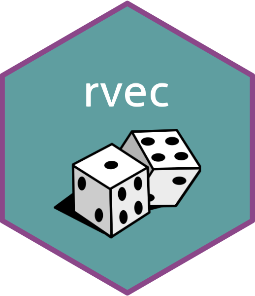

<!-- README.md is generated from README.Rmd. Please edit that file -->

```{r, include = FALSE}
knitr::opts_chunk$set(
  collapse = TRUE,
  comment = "#>",
  fig.path = "man/figures/README-",
  out.width = "100%"
)
```

# rvec <a href="https://github.com/bayesiandemography/rvec"></a>

<!-- badges: start -->
[](https://github.com/bayesiandemography/rvec/actions/workflows/R-CMD-check.yaml)
[](https://lifecycle.r-lib.org/articles/stages.html#experimental)
[](https://app.codecov.io/gh/bayesiandemography/rvec?branch=main)
<!-- badges: end -->

Tools for working with random draws, including draws from a simulation or Bayesian analysis. The main data structure is an `rvec`, which holds multiple draws but which behaves (mainly) like a standard R vector.


## Installation

``` r
install.packages("rvec")                            ## CRAN version
devtools::install_github("bayesiandemography/rvec") ## development version
```

## Example

```{r}
library(rvec, warn.conflicts = FALSE)
library(dplyr, warn.conflicts = FALSE)
```

Create an `rvec`.
```{r}
x <- rvec(rbind(c(10, 11),
                c(100, 101),
                c(1000, 1001)))
x
```

Perform arithmetic on it.
```{r}
x + 1
```

Put it in a tibble.
```{r}
df <- tibble(g = c(1, 2, 1), x)
df
```

Manipulate it in a tibble.
```{r}
df %>%
  group_by(g) %>%
  count(wt = x)
```

Summarise it.
```{r}
draws_mean(x)
```

## Other packages for working with random draws

- [rv](https://CRAN.R-project.org/package=rv)
- [posterior](https://CRAN.R-project.org/package=posterior)