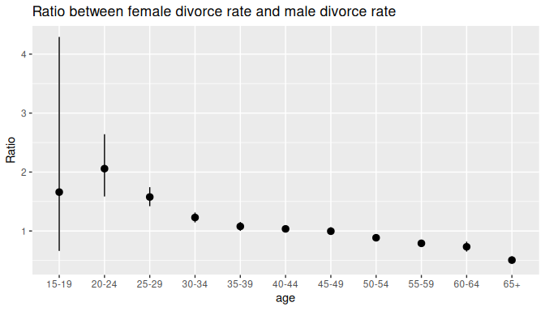

# Package rvec

## 1 Introduction

The `rvec` package provides tools for working with random draws. The
draws are held in a structure called an rvec. An rvec can, for many
purposes, be treated like an ordinary R vector, and manipulated using
standard functions from base R and the
[tidyverse](https://tidyverse.org/). `rvec` also provides tools for
summarising across draws to, for instance, produce point estimates or
credible intervals.

## 2 Examples

We start with some examples. Along with the `rvec` package, we will need
some tidyverse packages,

``` r

library(rvec)
library(dplyr)
library(tidyr)
library(ggplot2)
```

When `rvec` is loaded, R emits messages about functions such as
[`sd()`](https://bayesiandemography.github.io/rvec/reference/sd.md) and
[`var()`](https://bayesiandemography.github.io/rvec/reference/var.md)
being “masked”. However, these functions retain their usual behavior for
ordinary vectors, while gaining new behavior for rvecs. No action is
needed.

We create an rvec called `theta` containing three draws,

``` r

l <- list(c(3, 1, 0))
theta <- rvec(l)
theta
#> <rvec_dbl<3>[1]>
#> [1] 3,1,0
```

The header `<rvec_dbl<3>[1]>` describes the structure of `theta`:

- `_dbl` indicates that `theta` is composed of
  [doubles](https://www.rdocumentation.org/packages/base/versions/3.6.2/topics/double)
- `<3>` indicates that `theta` holds three random draws, and
- `[1]` indicates that each draw has length 1.

We can perform standard mathematical operations on `theta`,

``` r

theta^2 + 1
#> <rvec_dbl<3>[1]>
#> [1] 10,2,1
```

`theta` recycles to match the length of other vectors,

``` r

beta <- theta + c(1, -1)
beta
#> <rvec_dbl<3>[2]>
#> [1] 4,2,1  2,0,-1
```

The new rvec `beta` consists of three draws of a vector of length 2:

1.  the first vector, `c(4, 2)`, is obtained by adding `3` to
    `c(1, -1)`,
2.  the second vector, `c(2, 0)`, is obtained by adding `1` to
    `c(1, -1)`, and
3.  the third vector, `c(1, -1)`, is obtained by adding `0` to
    `c(1, -1)`.

To summarize across random draws, we use `draws_*` functions, e.g.,

``` r

draws_mean(beta)
#> [1] 2.3333333 0.3333333
```

or

``` r

draws_sd(beta)
#> [1] 1.527525 1.527525
```

Our next example is based on draws from the posterior distribution from
a Bayesian analysis of divorce in New Zealand. The posterior
distribution refers to divorces per thousand people per year,
disaggregated by age and sex. In their original form, the draws are not
stored as an rvec, but instead in a one-draw-per-row format,

``` r

divorce
#> # A tibble: 22,000 × 4
#>    age   sex     draw   rate
#>    <fct> <chr>  <int>  <dbl>
#>  1 15-19 Female     1 0.0462
#>  2 15-19 Female     2 0.0369
#>  3 15-19 Female     3 0.0448
#>  4 15-19 Female     4 0.0411
#>  5 15-19 Female     5 0.0333
#>  6 15-19 Female     6 0.0511
#>  7 15-19 Female     7 0.0249
#>  8 15-19 Female     8 0.0280
#>  9 15-19 Female     9 0.0339
#> 10 15-19 Female    10 0.0425
#> # ℹ 21,990 more rows
```

We use function
[`collapse_to_rvec()`](https://bayesiandemography.github.io/rvec/reference/collapse_to_rvec.md)
to convert from the one-draw-per-row format to an rvec,

``` r

divorce_rvec <- divorce |>
  collapse_to_rvec(values = rate)
divorce_rvec
#> # A tibble: 22 × 3
#>    age   sex                    rate
#>    <fct> <chr>          <rdbl<1000>>
#>  1 15-19 Female 0.036 (0.019, 0.068)
#>  2 20-24 Female    0.67 (0.58, 0.78)
#>  3 25-29 Female         3.2 (3, 3.4)
#>  4 30-34 Female       5.8 (5.5, 6.1)
#>  5 35-39 Female       6.5 (6.2, 6.9)
#>  6 40-44 Female       7.1 (6.8, 7.4)
#>  7 45-49 Female       7.2 (6.9, 7.6)
#>  8 50-54 Female         6 (5.8, 6.3)
#>  9 55-59 Female       4.4 (4.2, 4.7)
#> 10 60-64 Female         2.7 (2.5, 3)
#> # ℹ 12 more rows
```

[`collapse_to_rvec()`](https://bayesiandemography.github.io/rvec/reference/collapse_to_rvec.md)
ensures that, internally, draw 1 for females aged 15-19 lines up with
draw 1 for females aged 20-24, which lines up with draw 1 for females
aged 25-29, and so on.

In this example, the rvec has many draws, so, rather than showing each
draw, the print method shows the median value followed by the 2.5% and
97.5% quantiles.

We calculate the ratio between female and male divorce rates,

``` r

divorce_ratio <- divorce_rvec |>
  pivot_wider(names_from = sex, values_from = rate) |>
  mutate(ratio = Female / Male)
divorce_ratio
#> # A tibble: 11 × 4
#>    age                 Female                 Male             ratio
#>    <fct>         <rdbl<1000>>         <rdbl<1000>>      <rdbl<1000>>
#>  1 15-19 0.036 (0.019, 0.068) 0.022 (0.012, 0.041)   1.7 (0.66, 4.3)
#>  2 20-24    0.67 (0.58, 0.78)     0.33 (0.27, 0.4)    2.1 (1.6, 2.6)
#>  3 25-29         3.2 (3, 3.4)         2 (1.9, 2.2)    1.6 (1.4, 1.7)
#>  4 30-34       5.8 (5.5, 6.1)         4.7 (4.5, 5)    1.2 (1.1, 1.3)
#>  5 35-39       6.5 (6.2, 6.9)       6.1 (5.8, 6.4)      1.1 (1, 1.2)
#>  6 40-44       7.1 (6.8, 7.4)       6.9 (6.6, 7.2)     1 (0.98, 1.1)
#>  7 45-49       7.2 (6.9, 7.6)       7.3 (6.9, 7.6)     1 (0.93, 1.1)
#>  8 50-54         6 (5.8, 6.3)       6.8 (6.5, 7.1) 0.89 (0.83, 0.94)
#>  9 55-59       4.4 (4.2, 4.7)       5.6 (5.3, 5.9) 0.79 (0.74, 0.85)
#> 10 60-64         2.7 (2.5, 3)         3.7 (3.5, 4) 0.73 (0.65, 0.82)
#> 11 65+      0.84 (0.76, 0.93)       1.7 (1.5, 1.8) 0.51 (0.45, 0.57)
```

Note that although `rate`, `Female`, and `Male` in these calculations
are all rvecs, the code is identical to the code that would be needed
for an ordinary R vector.

To obtain point estimates and uncertainty measures for rvecs, we use the
`draw` functions.
[`draws_ci()`](https://bayesiandemography.github.io/rvec/reference/draws_ci.md),
for instance, returns medians and 95% credible intervals.

``` r

divorce_ratio  <- divorce_ratio |>
  mutate(draws_ci(ratio))
divorce_ratio
#> # A tibble: 11 × 7
#>    age                 Female                 Male             ratio ratio.lower
#>    <fct>         <rdbl<1000>>         <rdbl<1000>>      <rdbl<1000>>       <dbl>
#>  1 15-19 0.036 (0.019, 0.068) 0.022 (0.012, 0.041)   1.7 (0.66, 4.3)       0.662
#>  2 20-24    0.67 (0.58, 0.78)     0.33 (0.27, 0.4)    2.1 (1.6, 2.6)       1.59 
#>  3 25-29         3.2 (3, 3.4)         2 (1.9, 2.2)    1.6 (1.4, 1.7)       1.42 
#>  4 30-34       5.8 (5.5, 6.1)         4.7 (4.5, 5)    1.2 (1.1, 1.3)       1.15 
#>  5 35-39       6.5 (6.2, 6.9)       6.1 (5.8, 6.4)      1.1 (1, 1.2)       1.00 
#>  6 40-44       7.1 (6.8, 7.4)       6.9 (6.6, 7.2)     1 (0.98, 1.1)       0.982
#>  7 45-49       7.2 (6.9, 7.6)       7.3 (6.9, 7.6)     1 (0.93, 1.1)       0.934
#>  8 50-54         6 (5.8, 6.3)       6.8 (6.5, 7.1) 0.89 (0.83, 0.94)       0.831
#>  9 55-59       4.4 (4.2, 4.7)       5.6 (5.3, 5.9) 0.79 (0.74, 0.85)       0.735
#> 10 60-64         2.7 (2.5, 3)         3.7 (3.5, 4) 0.73 (0.65, 0.82)       0.651
#> 11 65+      0.84 (0.76, 0.93)       1.7 (1.5, 1.8) 0.51 (0.45, 0.57)       0.447
#> # ℹ 2 more variables: ratio.mid <dbl>, ratio.upper <dbl>
```

Next we graph the results,

``` r

ggplot(divorce_ratio,
       aes(x = age, 
           ymin = ratio.lower, 
           y = ratio.mid,
           ymax = ratio.upper)) +
  geom_pointrange() +
  ylab("Ratio") +
  ggtitle("Ratio between female divorce rate and male divorce rate")
```



## 3 Structure of an rvec

The class `"rvec"` has four subclasses:

- `"rvec_dbl"`, which holds doubles, e.g. `3.142`, `-1.01`;
- `"rvec_int"`, which holds integers, e.g. `42`, `-1`;
- `"rvec_lgl"`, which holds `TRUE`, `FALSE`, and `NA`; and
- `"rvec_chr"`, which holds characters, e.g. `"a"`, `"Thomas Bayes"`.

Internally, an rvec is a matrix, with each row representing one unknown
quantity, and each column representing one draw from the joint
distribution of the unknown quantities,

|                |      Draw 1      |      Draw 2      | \\\dots\\  |    Draw \\n\\    |
|----------------|:----------------:|:----------------:|:----------:|:----------------:|
| Quantity 1     | \\\theta\_{11}\\ | \\\theta\_{12}\\ | \\\dots\\  | \\\theta\_{1n}\\ |
| Quantity 2     | \\\theta\_{21}\\ | \\\theta\_{22}\\ | \\\dots\\  | \\\theta\_{2n}\\ |
| \\\vdots\\     |    \\\vdots\\    |    \\\vdots\\    | \\\ddots\\ |    \\\vdots\\    |
| Quantity \\m\\ | \\\theta\_{m1}\\ | \\\theta\_{m2}\\ | \\\dots\\  | \\\theta\_{mn}\\ |

**The internal structure of an rvec** {.table style="width:100%;"}

Ordinary functions are applied independently to each column. For
instance, calling [`sum()`](https://rdrr.io/r/base/sum.html) on an rvec
creates a new rvec with structure

Table : **The result of summing along the vector**

|  | Draw 1 | Draw 2 | \\\dots\\ | Draw \\n\\ |
|----|:--:|:--:|:--:|:--:|
| Quantity 1 | \\\sum\_{i=1}^m\theta\_{i1}\\ | \\\sum\_{i=1}^m\theta\_{i2}\\ | \\\dots\\ | \\\sum\_{i=1}^m\theta\_{in}\\ |

Functions with a `draws_` prefix are applied independently to each row.
For instance, calling
[`draws_mean()`](https://bayesiandemography.github.io/rvec/reference/draws_median.md)
on an rvec creates a new numeric vector with structure

|                |                  Value                   |
|----------------|:----------------------------------------:|
| Quantity 1     | \\\frac{1}{n}\sum\_{j=1}^n\theta\_{1j}\\ |
| Quantity 2     | \\\frac{1}{n}\sum\_{j=1}^n\theta\_{2j}\\ |
| \\\vdots\\     |                \\\vdots\\                |
| Quantity \\m\\ | \\\frac{1}{n}\sum\_{j=1}^n\theta\_{mj}\\ |

**The result of taking means across draws** {.table}

Each rvec holds a fixed number of draws. Two rvecs can only be used
together in a function if

1.  both rvecs contain the same number of draws, or
2.  one of the rvecs contains a single draw.

## 4 Creating rvecs

An individual rvec can be created from a list of vectors,

``` r

x <- list(LETTERS, letters)
rvec(x)
#> <rvec_chr<26>[2]>
#> [1] .."A".. .."a"..
```

a matrix,

``` r

x <- matrix(rnorm(2000), nrow = 2)
rvec(x)
#> <rvec_dbl<1000>[2]>
#> [1] -0.026 (-1.9, 1.9) -0.031 (-1.9, 2)
```

or an atomic vector

``` r

x <- c(TRUE, FALSE)
rvec(x)
#> <rvec_lgl<1>[2]>
#> [1] T F
```

Function
[`rvec()`](https://bayesiandemography.github.io/rvec/reference/rvec.md)
chooses from classes `"rvec_dbl"`, `"rvec_int"`, `"rvec_lgl"`, and
`"rvec_chr"`, based on the input. To enforce a particular choice of
class, use function
[`rvec_dbl()`](https://bayesiandemography.github.io/rvec/reference/rvec.md),
[`rvec_int()`](https://bayesiandemography.github.io/rvec/reference/rvec.md),
[`rvec_lgl()`](https://bayesiandemography.github.io/rvec/reference/rvec.md),
or
[`rvec_chr()`](https://bayesiandemography.github.io/rvec/reference/rvec.md),

``` r

x <- list(1:3)
rvec(x)
#> <rvec_int<3>[1]>
#> [1] 1,2,3
rvec_dbl(x)
#> <rvec_dbl<3>[1]>
#> [1] 1,2,3
rvec_chr(x)
#> <rvec_chr<3>[1]>
#> [1] "1","2","3"
```

When the raw data take the form of a data frame with one draw per row,
the most efficient way to create rvecs is to use
[`collapse_to_rvec()`](https://bayesiandemography.github.io/rvec/reference/collapse_to_rvec.md).
See Section [2](#sec:examples) for an example.

Section [6](#sec:prob) shows how to create an rvec consisting of draws
from a standard probability distribution.

## 5 Mathematical and logical operations

Mathematical and logical operations are applied independently to each
draw.

``` r

x <- rvec(list(c(TRUE, FALSE),
               c(TRUE, TRUE)))
x          
#> <rvec_lgl<2>[2]>
#> [1] T,F T,T
all(x)
#> <rvec_lgl<2>[1]>
#> [1] T,F
any(x)
#> <rvec_lgl<2>[1]>
#> [1] T,T
```

User-defined functions that consist entirely of standard mathematical
and logical operations should work with no modifications.

``` r

logit <- function(p) log(p / (1-p))
tibble(
  x = rvec(list(c(0.2, 0.4),
                c(0.6, 0.9))),
  y = logit(x)
)
#> # A tibble: 2 × 2
#>           x              y
#>   <rdbl<2>>      <rdbl<2>>
#> 1   0.2,0.4 -1.386,-0.4055
#> 2   0.6,0.9   0.4055,2.197
```

Multiplying an rvec by a matrix produces an rvec (though only with R
version 4.3.0 and higher)

``` r

if (getRversion() >= "4.3.0") {
  m <- rbind(c(1, 1),
             c(0, 1))
  x <- rvec(list(1:2,
                 3:4))
  m %*% x
}
#> <rvec_dbl<2>[2]>
#> [1] 4,6 3,4
```

`rvec` contains a suite of functions for summarising weighted data, such
as
[`weighted_mean()`](https://bayesiandemography.github.io/rvec/reference/weighted_mean.md)
and
[`weighted_var()`](https://bayesiandemography.github.io/rvec/reference/weighted_mean.md).

## 6 Probability distributions

Standard R probability functions such as
[`dnorm()`](https://rdrr.io/r/stats/Normal.html) or
[`rbinom()`](https://rdrr.io/r/stats/Binomial.html) do not allow rvec
arguments. Package `rvec` provides modified functions that do. For
instance,

``` r

y <- rvec(list(c(-1, 0.2),
               c(3, -7)))
mu <- rvec(list(c(0, 1),
                c(0, -1)))
dnorm_rvec(y, mean = mu, sd = 3)
#> <rvec_dbl<2>[2]>
#> [1] 0.1258,0.1283 0.08066,0.018
rbinom_rvec(n = 2, size = round(y+10), prob = 0.8)
#> <rvec_dbl<2>[2]>
#> [1] 8,8  11,2
```

The return value from an `rvec` probability function is an rvec if and
only if at least one argument to the function is an rvec, with one
exception. The exception is random variate functions, where a value can
be supplied for a special argument called `n_draw`. When a value for
`n_draw` is supplied, the return value is an rvec with `n_draw` draws,

``` r

rnorm_rvec(n = 3, mean = 100, sd = 10, n_draw = 2)
#> <rvec_dbl<2>[3]>
#> [1] 93.38,93.98 94.69,96.82 96.99,103.1
```

This is a convenient way to create inputs to a simulation.

## 7 Manipulating rvecs

### 7.1 Compatibility with base R

Most code for manipulating ordinary R vectors should continue to work
when applied to rvecs. There are, however, important base R functions
where things go wrong. In each case, however, there are alternatives.

| Base R function(s) | What goes wrong | Alternative |
|:---|:---|:---|
| [`rbind()`](https://rdrr.io/r/base/cbind.html) | Creates a list matrix | [`dplyr::bind_rows`](https://dplyr.tidyverse.org/reference/bind_rows.html) or [`vctrs::vec_rbind()`](https://vctrs.r-lib.org/reference/vec_bind.html) |
| [`cbind()`](https://rdrr.io/r/base/cbind.html) | Creates a list matrix | [`dplyr::bind_cols`](https://dplyr.tidyverse.org/reference/bind_cols.html) or [`vctrs::vec_cbind()`](https://vctrs.r-lib.org/reference/vec_bind.html) |
| [`ifelse()`](https://rdrr.io/r/base/ifelse.html) | Doesn’t preserve the rvec structure. | [`rvec::if_else_rvec()`](https://bayesiandemography.github.io/rvec/reference/if_else_rvec.md); [`dplyr::if_else()`](https://dplyr.tidyverse.org/reference/if_else.html) also works when `condition` is an ordinary vector |
| [`sapply()`](https://rdrr.io/r/base/lapply.html), [`vapply()`](https://rdrr.io/r/base/lapply.html) | Doesn’t combine results into an rvec | [`rvec::map_rvec()`](https://bayesiandemography.github.io/rvec/reference/map_rvec.md) or [`lapply()`](https://rdrr.io/r/base/lapply.html) |

### 7.2 Subsetting

Standard R ways of selecting elements from vectors work with rvecs.

``` r

x <- rvec(list(a = 1:2,
               b = 3:4,
               c = 5:6))
x[1]  ## element number
#> <rvec_int<2>[1]>
#>   a 
#> 1,2
x[c("a", "c")]  ## element name
#> <rvec_int<2>[2]>
#>   a   c 
#> 1,2 5,6
x[c(TRUE, FALSE, TRUE)]  ## logical flag
#> <rvec_int<2>[2]>
#>   a   c 
#> 1,2 5,6
```

### 7.3 If-Else

The standard R function [`ifelse()`](https://rdrr.io/r/base/ifelse.html)
does not preserve the structure of an rvec.

The tidyverse function
[`if_else()`](https://dplyr.tidyverse.org/reference/if_else.html) works
when the `true`, `false`, or `missing` arguments are rvecs,

``` r

x <- rvec(list(1:2,
               3:4))
if_else(condition = c(TRUE, FALSE), 
        true = x,
        false = -x)        
#> <rvec_int<2>[2]>
#> [1] 1,2   -3,-4
```

However,
[`if_else()`](https://dplyr.tidyverse.org/reference/if_else.html) does
not work when the `condition` argument is an rvec. For this we need
`rvec` function
[`if_else_rvec()`](https://bayesiandemography.github.io/rvec/reference/if_else_rvec.md),

``` r

if_else_rvec(x <= 2, x, 2)
#> <rvec_dbl<2>[2]>
#> [1] 1,2 2,2
```

Function
[`if_else_rvec()`](https://bayesiandemography.github.io/rvec/reference/if_else_rvec.md)
can be used to independently transform or recode values across different
draws,

``` r

x <- rvec(list(c(1, 3.3),
               c(NA, -2)))
x
#> <rvec_dbl<2>[2]>
#> [1] 1,3.3 NA,-2
x_recode <- if_else_rvec(is.na(x), 99, x)
x_recode
#> <rvec_dbl<2>[2]>
#> [1] 1,3.3 99,-2
```

### 7.4 Combining

The standard R concatenation function
[`c()`](https://rdrr.io/r/base/c.html) works with rvecs,

``` r

x1 <- rvec(list(c(0.1, 0.2),
                c(0.3, 0.4)))
x2 <- rvec(list(c(0.5, 0.6),
                c(0.7, 0.8)))
c(x1, x2)
#> <rvec_dbl<2>[4]>
#> [1] 0.1,0.2 0.3,0.4 0.5,0.6 0.7,0.8
```

Unfortunately, [`cbind()`](https://rdrr.io/r/base/cbind.html) and
[`rbind()`](https://rdrr.io/r/base/cbind.html) cannot be made to work
properly on raw rvecs,

``` r

rbind(x1, x2)
#>    data     
#> x1 numeric,4
#> x2 numeric,4
cbind(x1, x2)
#>      x1        x2       
#> data numeric,4 numeric,4
```

though [`cbind()`](https://rdrr.io/r/base/cbind.html) does work if the
rvecs are contained in data frames

``` r

df1 <- data.frame(x1)
df2 <- data.frame(x2)
cbind(df1, df2)
#>        x1      x2
#> 1 0.1,0.2 0.5,0.6
#> 2 0.3,0.4 0.7,0.8
```

With rvec columns in data frames,
[`dplyr::bind_rows()`](https://dplyr.tidyverse.org/reference/bind_rows.html)
and
[`vctrs::vec_rbind()`](https://vctrs.r-lib.org/reference/vec_bind.html)
combine rows. To create columns from bare rvecs, use
[`dplyr::bind_cols()`](https://dplyr.tidyverse.org/reference/bind_cols.html)
or
[`vctrs::vec_cbind()`](https://vctrs.r-lib.org/reference/vec_bind.html),

``` r

library(vctrs, warn.conflicts = FALSE)
vec_cbind(a = x1, b = x2)
#>         a       b
#> 1 0.1,0.2 0.5,0.6
#> 2 0.3,0.4 0.7,0.8
```

When each result is an rvec, base R’s
[`sapply()`](https://rdrr.io/r/base/lapply.html) does not combine them
into one rvec (`simplify = FALSE` keeps a list).
[`map_rvec()`](https://bayesiandemography.github.io/rvec/reference/map_rvec.md),
based on map functions in package [purrr](https://purrr.tidyverse.org),
combines length-one rvec results:

``` r

l <- list(a = rvec(list(c(1, 4))),
          b = rvec(list(c(9, 16))))
l
#> $a
#> <rvec_dbl<2>[1]>
#> [1] 1,4
#> 
#> $b
#> <rvec_dbl<2>[1]>
#> [1] 9,16
map_rvec(l, sqrt)
#> <rvec_dbl<2>[2]>
#>   a   b 
#> 1,2 3,4
```

### 7.5 Coercing

Function [`as.matrix()`](https://rdrr.io/r/base/matrix.html) returns the
data underlying an rvec.

``` r

m <- matrix(1:6, nr = 2)
m
#>      [,1] [,2] [,3]
#> [1,]    1    3    5
#> [2,]    2    4    6
x <- rvec(m)
x
#> <rvec_int<3>[2]>
#> [1] 1,3,5 2,4,6
as.matrix(x)
#>      [,1] [,2] [,3]
#> [1,]    1    3    5
#> [2,]    2    4    6
```

Function
[`as_list_col()`](https://bayesiandemography.github.io/rvec/reference/as_list_col.md)
returns a list of vectors

``` r

as_list_col(x)
#> [[1]]
#> [1] 1 3 5
#> 
#> [[2]]
#> [1] 2 4 6
```

Functions such as
[point_interval](https://mjskay.github.io/ggdist/reference/point_interval.html)
in package [ggdist](https://mjskay.github.io/ggdist/) accept lists of
vectors. A good way to access the facilities for working with random
draws in `ggdist`, or in packages such as
[tidybayes](https://mjskay.github.io/tidybayes/) and
[bayesplot](https://mc-stan.org/bayesplot/), is to use
[`as_list_col()`](https://bayesiandemography.github.io/rvec/reference/as_list_col.md)
to convert an rvec to a list column.

Function
[`expand_from_rvec()`](https://bayesiandemography.github.io/rvec/reference/collapse_to_rvec.md)
is the inverse of function
[`collapse_to_rvec()`](https://bayesiandemography.github.io/rvec/reference/collapse_to_rvec.md),
introduced in Section [2](#sec:examples).

``` r

divorce |>
  head(2)
#> # A tibble: 2 × 4
#>   age   sex     draw   rate
#>   <fct> <chr>  <int>  <dbl>
#> 1 15-19 Female     1 0.0462
#> 2 15-19 Female     2 0.0369
divorce |>
  collapse_to_rvec(values = rate) |>
  head(2)
#> # A tibble: 2 × 3
#>   age   sex                    rate
#>   <fct> <chr>          <rdbl<1000>>
#> 1 15-19 Female 0.036 (0.019, 0.068)
#> 2 20-24 Female    0.67 (0.58, 0.78)
divorce |>
  collapse_to_rvec(values = rate) |>
  expand_from_rvec() |>
  head(2)
#> # A tibble: 2 × 4
#>   age   sex     draw   rate
#>   <fct> <chr>  <int>  <dbl>
#> 1 15-19 Female     1 0.0462
#> 2 15-19 Female     2 0.0369
```

## 8 Summarising distributions

Most functions in `rvec` are concerned with deriving random vectors from
other random vectors: that is, with the column-wise calculations
described in Section [3](#sec:structure). But once we have derived the
random vectors, we typically want to summarise them, using statistics
such as means or quantiles: that is, we want to carry out row-wise
calculations.

The functions for carrying out row-wise calculations on rvecs include,
for instance,
[`draws_median()`](https://bayesiandemography.github.io/rvec/reference/draws_median.md)
to calculate the median values across draws, and
[`draws_var()`](https://bayesiandemography.github.io/rvec/reference/draws_sd.md)
to calculate variance across draws.

Most draws functions use
[matrixStats](https://CRAN.R-project.org/package=matrixStats) internally
and are therefore fast.

## 9 Similar packages

The first R package to provide a specialized object for handling
multiple draws was [rv](https://CRAN.R-project.org/package=rv). The
specialized object, called an rv, can be manipulated and summarized much
like an rvec. However, in software terms, an rv is not strictly a vector
and does not behave like one inside a data frame. It is therefore not
well suited to tidyverse-style work flows.

R package [posterior](https://CRAN.R-project.org/package=posterior)
provides several data structures for handling multiple draws. One of
these – the rvar – is similar to an rvec. An rvar is, however, not
limited to a single dimension, and has special facilities for dealing
with multiple chains (as produced by Markov chain Monte Carlo methods).
These features are essential for some analyses, but they can make rvars
harder to master, and they are not needed for most tidyverse-style work
flows.

Another important difference between rvecs and rvars is the way that
they implement standard functions such as
[`mean()`](https://rdrr.io/r/base/mean.html) and
[`sum()`](https://rdrr.io/r/base/sum.html). Calling
[`mean()`](https://rdrr.io/r/base/mean.html) on an rvec yields the mean
across elements within each draw. Means across draws within each element
are obtained by calling
[`draws_mean()`](https://bayesiandemography.github.io/rvec/reference/draws_median.md).
In contrast, calling [`mean()`](https://rdrr.io/r/base/mean.html) on an
rvar yields the mean across draws within each element. Means across
elements with each draw are obtained by calling `rvar_mean()`.

The differences in implementation imply that code written for an
ordinary R vector generalises naturally to rvecs but not to rvars. Code
such as `x <- median(y)` that was written originally for a numeric
vector will continue to yield medians over elements of `y` if `y` is an
rvec. If `y` is an rvar, however, then the code will yield medians over
draws, which is a substantial change in meaning.
