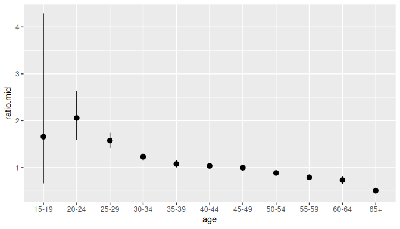

# Package rvec

## 1 Aims of **rvec**

Many statistical models – espeicially if they are Bayesian statistical
models – produce random draws from a distribution. A useful feature of
these draws is that they can be used to make inferences about derived
quantities. The procedure is:

- Step 1. Calculate the derived quantity for each of the random draws.
- Step 2. Summaries the distribution of these derived quantities.

If, for instance, we have randoms draws of age-specific mortality rates,
and we want make inferences about life expectancy (a summary indicator
for mortality rates), then we proceed as follows:

- Step 1. Derive life expectancy for each set of age-specific mortality
  rates.
- Step 2. Calculate means, medians, or other statistics for these life
  expectancies.

For more on the theory behind manipulating random draws, and for an
argument that R needs high-level tools to help with this manipulation,
see Kerman and Gelman (2007).

Package `rvec` provides tools for working with random draws. The draws
are held in a structure called an rvec, which can, for many purposes, be
treated like an ordinary R vector, and manipulated using ordinary base R
and [tidyverse](https://www.tidyverse.org) code. `rvec` also contains
functions for summarizing across random draws.

## 2 Examples

### 2.1 Toy example

We begin with a toy example to illustrate basic functionality.

``` r
library(rvec)
#> 
#> Attaching package: 'rvec'
#> The following objects are masked from 'package:stats':
#> 
#>     sd, var
#> The following object is masked from 'package:base':
#> 
#>     rank
l <- list(c(3, 1, 0))
theta <- rvec(l)
theta
#> <rvec_dbl<3>[1]>
#> [1] 3,1,0
```

The header `<rvec_dbl<3>[1]>` describe the structure of `theta`:

- `_dbl` indicates that `theta` is composed of
  [doubles](https://www.rdocumentation.org/packages/base/versions/3.6.2/topics/double)
- `<3>` indicates that `theta` holds three random draws, and
- `[1]` indicates that each draw has length 1.

We can perform standard mathematical operations:

``` r
theta^2 + 1
#> <rvec_dbl<3>[1]>
#> [1] 10,2,1
```

`theta` recycles to match the length of other vectors,

``` r
beta <- theta + c(1, -1)
beta
#> <rvec_dbl<3>[2]>
#> [1] 4,2,1  2,0,-1
```

`beta` consists of three draws:

1.  `c(4, 2)`, obtained from adding `3` and `c(1, -1)`,
2.  `c(2, 0)`, obtained from adding `1` and `c(1, -1)`, and
3.  `c(1, -1)`, obtained from adding `0` and `c(1, -1)`.

To summarize across random draws, we use `draws_*` functions, e.g.

``` r
draws_mean(beta)
#> [1] 2.3333333 0.3333333
```

### 2.2 Divorce rates

Our next example is more involved, and includes the use of some standard
tidyverse packages.

``` r
library(dplyr)
library(tidyr)
library(ggplot2)
```

We analyse a posterior sample from a Bayesian model of divorce rates in
New Zealand. The rates are divorces per thousand people per year,
disaggregated by age and sex. The rates are not stored as an rvec, but
instead in a ‘data base’ format, where each row describes a single draw.

``` r
divorce
#> # A tibble: 22,000 × 4
#>    age   sex     draw   rate
#>    <fct> <chr>  <int>  <dbl>
#>  1 15-19 Female     1 0.0462
#>  2 15-19 Female     2 0.0369
#>  3 15-19 Female     3 0.0448
#>  4 15-19 Female     4 0.0411
#>  5 15-19 Female     5 0.0333
#>  6 15-19 Female     6 0.0511
#>  7 15-19 Female     7 0.0249
#>  8 15-19 Female     8 0.0280
#>  9 15-19 Female     9 0.0339
#> 10 15-19 Female    10 0.0425
#> # ℹ 21,990 more rows
```

First we convert from database format to rvec format.

``` r
divorce_rv <- divorce |>
  collapse_to_rvec(value = rate)
divorce_rv
#> # A tibble: 22 × 3
#>    age   sex                    rate
#>    <fct> <chr>          <rdbl<1000>>
#>  1 15-19 Female 0.036 (0.019, 0.068)
#>  2 20-24 Female    0.67 (0.58, 0.78)
#>  3 25-29 Female         3.2 (3, 3.4)
#>  4 30-34 Female       5.8 (5.5, 6.1)
#>  5 35-39 Female       6.5 (6.2, 6.9)
#>  6 40-44 Female       7.1 (6.8, 7.4)
#>  7 45-49 Female       7.2 (6.9, 7.6)
#>  8 50-54 Female         6 (5.8, 6.3)
#>  9 55-59 Female       4.4 (4.2, 4.7)
#> 10 60-64 Female         2.7 (2.5, 3)
#> # ℹ 12 more rows
```

When the number of draws is large, the print method for rvecs of doubles
displays `<median> (<2.5% quantile>, <97.5% quantile>)`, rather than the
individual draws.

We define the ‘total divorce rate’ to be the number of divorces that a
person would expect to experience over their lifetime under prevailing
divorce rates. The total divorce rate can be calculated as

``` r
divorce_rv |>
  group_by(sex) |>
  summarise(TDR = sum(rate) * 5 / 1000)
#> # A tibble: 2 × 2
#>   sex                  TDR
#>   <chr>       <rdbl<1000>>
#> 1 Female 0.22 (0.22, 0.23)
#> 2 Male   0.23 (0.22, 0.23)
```

We summarize across draws using
[`draws_ci()`](https://bayesiandemography.github.io/rvec/reference/draws_ci.md),
which, by default, calculates medians and 95% credible intervals.
Function
[`draws_ci()`](https://bayesiandemography.github.io/rvec/reference/draws_ci.md)
returns a tibble rather than a vector, so, following standard `mutate`
rules, we do not explicitly create new columns.

``` r
divorce_rv |>
  group_by(sex) |>
  summarise(tdr = sum(rate) * 5 / 1000) |>
  mutate(draws_ci(tdr))
#> # A tibble: 2 × 5
#>   sex                  tdr tdr.lower tdr.mid tdr.upper
#>   <chr>       <rdbl<1000>>     <dbl>   <dbl>     <dbl>
#> 1 Female 0.22 (0.22, 0.23)     0.218   0.223     0.228
#> 2 Male   0.23 (0.22, 0.23)     0.221   0.226     0.231
```

Next we calculate the ratio between female and male divorce rates,

``` r
divorce_ratio <- divorce_rv |>
  pivot_wider(names_from = sex, values_from = rate) |>
  mutate(ratio = Female / Male) |>
  mutate(draws_ci(ratio))
```

and graph the result

``` r
ggplot(divorce_ratio,
       aes(x = age, 
           ymin = ratio.lower, 
           y = ratio.mid,
           ymax = ratio.upper)) +
  geom_pointrange()
```



## 3 Structure of an rvec

The class `"rvec"` has four subclasses:

- `"rvec_dbl"`, which holds doubles, e.g. `3.142`, `-1.01`;
- `"rvec_int"`, which holds integers, e.g. `42`, `-1`;
- `"rvec_lgl"`, which holds `TRUE`, `FALSE`, and `NA`; and
- `"rvec_chr"`, which hold characters, e.g. `"a"`, `"Thomas Bayes"`.

Internally, an rvec is a matrix, with each row representing one unknown
quantity, and each column representing one draw from the joint
distribution of the unknown quantities,

|                |      Draw 1      |      Draw 2      | \\\dots\\  |    Draw \\n\\    |
|----------------|:----------------:|:----------------:|:----------:|:----------------:|
| Quantity 1     | \\\theta\_{11}\\ | \\\theta\_{12}\\ | \\\dots\\  | \\\theta\_{1n}\\ |
| Quantity 2     | \\\theta\_{21}\\ | \\\theta\_{22}\\ | \\\dots\\  | \\\theta\_{2n}\\ |
| \\\vdots\\     |    \\\vdots\\    |    \\\vdots\\    | \\\ddots\\ |    \\\vdots\\    |
| Quantity \\m\\ | \\\theta\_{m1}\\ | \\\theta\_{m2}\\ | \\\dots\\  | \\\theta\_{mn}\\ |

**The internal structure of an rvec**

Ordinary functions are applied independently to each column. For
instance, calling [`sum()`](https://rdrr.io/r/base/sum.html) on an rvec
creates a new rvec with structure

Table : **The result of summing along the vector**

|            |            Draw 1             |            Draw 2             | \\\dots\\ |          Draw \\n\\           |
|------------|:-----------------------------:|:-----------------------------:|:---------:|:-----------------------------:|
| Quantity 1 | \\\sum\_{i=1}^m\theta\_{i1}\\ | \\\sum\_{i=1}^m\theta\_{i2}\\ | \\\dots\\ | \\\sum\_{i=1}^m\theta\_{in}\\ |

Functions with a `draws_` prefix are applied independently to each row.
For instance, calling
[`draws_mean()`](https://bayesiandemography.github.io/rvec/reference/draws_median.md)
on an rvec creates a new numeric vector with structure

|                |                  Value                   |
|----------------|:----------------------------------------:|
| Quantity 1     | \\\frac{1}{n}\sum\_{j=1}^n\theta\_{1j}\\ |
| Quantity 2     | \\\frac{1}{n}\sum\_{j=1}^n\theta\_{2j}\\ |
| \\\vdots\\     |                \\\vdots\\                |
| Quantity \\m\\ | \\\frac{1}{n}\sum\_{j=1}^n\theta\_{mj}\\ |

**The result of taking means across draws**

Each rvec holds a fixed number of draws. Two rvecs can only be used
together in a function if

1.  both rvecs contain the same number of draws, or
2.  one of the rvecs contains a single draw.

## 4 Creating rvecs

An individual rvec can be created from a list of vectors,

``` r
x <- list(LETTERS, letters)
rvec(x)
#> <rvec_chr<26>[2]>
#> [1] .."A".. .."a"..
```

a matrix,

``` r
x <- matrix(rnorm(2000), nrow = 2)
rvec(x)
#> <rvec_dbl<1000>[2]>
#> [1] -0.026 (-1.9, 1.9) -0.031 (-1.9, 2)
```

or an atomic vector

``` r
x <- c(TRUE, FALSE)
rvec(x)
#> <rvec_lgl<1>[2]>
#> [1] T F
```

Function
[`rvec()`](https://bayesiandemography.github.io/rvec/reference/rvec.md)
chooses from classes `"rvec_dbl"`, `"rvec_int"`, `"rvec_lgl"`, and
`"rvec_chr"`, based on the input. To enforce a particular choice of
class, use function
[`rvec_dbl()`](https://bayesiandemography.github.io/rvec/reference/rvec.md),
[`rvec_int()`](https://bayesiandemography.github.io/rvec/reference/rvec.md),
[`rvec_lgl()`](https://bayesiandemography.github.io/rvec/reference/rvec.md),
or
[`rvec_chr()`](https://bayesiandemography.github.io/rvec/reference/rvec.md),

``` r
x <- list(1:3)
rvec(x)
#> <rvec_int<3>[1]>
#> [1] 1,2,3
rvec_dbl(x)
#> <rvec_dbl<3>[1]>
#> [1] 1,2,3
rvec_chr(x)
#> <rvec_chr<3>[1]>
#> [1] "1","2","3"
```

When the raw data take the form of a database with one draw per row, the
most efficient way to create rvecs is to use
[`collapse_to_rvec()`](https://bayesiandemography.github.io/rvec/reference/collapse_to_rvec.md).
See Section [2.2](#sec:divorce) for an example.

Section [6](#sec:prob) shows how to create an rvec consisting of draws
from a standard probability distribution.

## 5 Mathematical and logical operations

Mathematical and logical operations are applied independently to each
draw.

``` r
x <- rvec(list(c(TRUE, FALSE),
               c(TRUE, TRUE)))
x          
#> <rvec_lgl<2>[2]>
#> [1] T,F T,T
all(x)
#> <rvec_lgl<2>[1]>
#> [1] T,F
any(x)
#> <rvec_lgl<2>[1]>
#> [1] T,T
```

User-defined functions that consist entirely of standard mathematical
and logical operations should work with no modifications.

``` r
logit <- function(p) log(p / (1-p))
tibble(
  x = rvec(list(c(0.2, 0.4),
                c(0.6, 0.9))),
  y = logit(x)
)
#> # A tibble: 2 × 2
#>           x              y
#>   <rdbl<2>>      <rdbl<2>>
#> 1   0.2,0.4 -1.386,-0.4055
#> 2   0.6,0.9   0.4055,2.197
```

Multiplying an rvec by a matrix produces an rvec,

``` r
m <- rbind(c(1, 1),
           c(0, 1))
x <- rvec(list(1:2,
               3:4))
m %*% x
#> <rvec_dbl<2>[2]>
#> [1] 4,6 3,4
```

`rvec` contains a suite of functions for summarising weighted data:

- [`weighted_mad()`](https://bayesiandemography.github.io/rvec/reference/weighted_mean.md)
- [`weighted_mean()`](https://bayesiandemography.github.io/rvec/reference/weighted_mean.md)
- [`weighted_median()`](https://bayesiandemography.github.io/rvec/reference/weighted_mean.md)
- [`weighted_sd()`](https://bayesiandemography.github.io/rvec/reference/weighted_mean.md)
- [`weighted_var()`](https://bayesiandemography.github.io/rvec/reference/weighted_mean.md)

All of these are built on functions from package
[matrixStats](https://CRAN.R-project.org/package=matrixStats).

The elements of an rvec do not have a well-defined order when there is
more than one draw. Functions
[`sort()`](https://rdrr.io/r/base/sort.html) and
[`order()`](https://rdrr.io/r/base/order.html) fail when called on an
rvec, unless `n_draw` is 1.

Ranking does, however, have a useful interpretation. We apply the
ranking operation independently to each draw, and return the results as
an integer rvec.

``` r
divorce_ratio |> 
  select(age, ratio) |>
  mutate(rank = rank(ratio))
#> # A tibble: 11 × 3
#>    age               ratio         rank
#>    <fct>      <rdbl<1000>> <rint<1000>>
#>  1 15-19   1.7 (0.66, 4.3)   10 (2, 11)
#>  2 20-24    2.1 (1.6, 2.6)  11 (10, 11)
#>  3 25-29    1.6 (1.4, 1.7)    9 (9, 10)
#>  4 30-34    1.2 (1.1, 1.3)     8 (8, 9)
#>  5 35-39      1.1 (1, 1.2)     7 (5, 8)
#>  6 40-44     1 (0.98, 1.1)     6 (5, 7)
#>  7 45-49     1 (0.93, 1.1)     5 (5, 7)
#>  8 50-54 0.89 (0.83, 0.94)     4 (4, 5)
#>  9 55-59 0.79 (0.74, 0.85)     3 (2, 4)
#> 10 60-64 0.73 (0.65, 0.82)     2 (2, 3)
#> 11 65+   0.51 (0.45, 0.57)     1 (1, 1)
```

In the example above, the rank of the 15-19 age group is uncertain,
while the rank of the 65+ age group is estimated precisely.

## 6 Probability distributions

Standard R probability functions such as
[`dnorm()`](https://rdrr.io/r/stats/Normal.html) or
[`rbinom()`](https://rdrr.io/r/stats/Binomial.html) do not allow rvec
arguments. Package `rvec` provides modified functions that do. For
instance,

``` r
y <- rvec(list(c(-1, 0.2),
               c(3, -7)))
mu <- rvec(list(c(0, 1),
                c(0, -1)))
dnorm_rvec(y, mean = mu, sd = 3)
#> <rvec_dbl<2>[2]>
#> [1] 0.1258,0.1283 0.08066,0.018
rbinom_rvec(n = 2, size = round(y+10), prob = 0.8)
#> <rvec_dbl<2>[2]>
#> [1] 8,8  11,2
```

The return value from an `rvec` probability function is an rvec if and
only if at least one argument to the function is an rvec, with one
exception. The exception is random variate functions, where a value can
be supplied for a special argument called `n_draw`. When a value for
`n_draw` is supplied, the return value is an rvec with `n_draw` draws,

``` r
rnorm_rvec(n = 3, mean = 100, sd = 10, n_draw = 2)
#> <rvec_dbl<2>[3]>
#> [1] 93.38,93.98 94.69,96.82 96.99,103.1
```

This is a convenient way to create inputs to a simulation.

## 7 Manipulating rvecs

### 7.1 Subsetting

Standard R ways of selecting elements from vectors work with rvecs.

``` r
x <- rvec(list(a = 1:2,
               b = 3:4,
               c = 5:6))
x[1]  ## element number
#> <rvec_int<2>[1]>
#>   a 
#> 1,2
x[c("a", "c")]  ## element name
#> <rvec_int<2>[2]>
#>   a   c 
#> 1,2 5,6
x[c(TRUE, FALSE, TRUE)]  ## logical flag
#> <rvec_int<2>[2]>
#>   a   c 
#> 1,2 5,6
```

### 7.2 If-Else

The standard R function [`ifelse()`](https://rdrr.io/r/base/ifelse.html)
does not work at all with rvecs.

The tidyverse function
[`if_else()`](https://dplyr.tidyverse.org/reference/if_else.html) works
when the `true`, `false`, or `missing` arguments are rvecs,

``` r
x <- rvec(list(1:2,
               3:4))
if_else(condition = c(TRUE, FALSE), 
        true = x,
        false = -x)        
#> <rvec_int<2>[2]>
#> [1] 1,2   -3,-4
```

However,
[`if_else()`](https://dplyr.tidyverse.org/reference/if_else.html) does
not work when the `condition` argument is an rvec. For this we need
`rvec` function
[`if_else_rvec()`](https://bayesiandemography.github.io/rvec/reference/if_else_rvec.md),

``` r
if_else_rvec(x <= 2, x, 2)
#> <rvec_dbl<2>[2]>
#> [1] 1,2 2,2
```

Function
[`if_else_rvec()`](https://bayesiandemography.github.io/rvec/reference/if_else_rvec.md)
can be used to independently transform or recode values across different
draws,

``` r
x <- rvec(list(c(1, 3.3),
               c(NA, -2)))
x
#> <rvec_dbl<2>[2]>
#> [1] 1,3.3 NA,-2
x_recode <- if_else_rvec(is.na(x), 99, x)
x_recode
#> <rvec_dbl<2>[2]>
#> [1] 1,3.3 99,-2
```

### 7.3 Combining

The standard R concatenation function
[`c()`](https://rdrr.io/r/base/c.html) works with rvecs,

``` r
x1 <- rvec(list(c(0.1, 0.2),
                c(0.3, 0.4)))
x2 <- rvec(list(c(0.5, 0.6),
                c(0.7, 0.8)))
c(x1, x2)
#> <rvec_dbl<2>[4]>
#> [1] 0.1,0.2 0.3,0.4 0.5,0.6 0.7,0.8
```

Unfortunately, [`cbind()`](https://rdrr.io/r/base/cbind.html) and
[`rbind()`](https://rdrr.io/r/base/cbind.html) cannot be made to work
properly on raw rvecs,

``` r
rbind(x1, x2)
#>    data     
#> x1 numeric,4
#> x2 numeric,4
cbind(x1, x2)
#>      x1        x2       
#> data numeric,4 numeric,4
```

though [`cbind()`](https://rdrr.io/r/base/cbind.html) does work if the
rvecs are contained in data frames

``` r
df1 <- data.frame(x1)
df2 <- data.frame(x2)
cbind(df1, df2)
#>        x1      x2
#> 1 0.1,0.2 0.5,0.6
#> 2 0.3,0.4 0.7,0.8
```

Tidyverse equivalents such as
[`dplyr::bind_rows()`](https://dplyr.tidyverse.org/reference/bind_rows.html),
`dbplyr::bind_cols()`,
[`vctrs::vec_cbind()`](https://vctrs.r-lib.org/reference/vec_bind.html),
and
[`vctrs::vec_rbind()`](https://vctrs.r-lib.org/reference/vec_bind.html)
*do* work with rvecs,

``` r
library(vctrs, warn.conflicts = FALSE)
vec_cbind(a = x1, b = x2)
#>         a       b
#> 1 0.1,0.2 0.5,0.6
#> 2 0.3,0.4 0.7,0.8
```

Base R function [`sapply()`](https://rdrr.io/r/base/lapply.html) does
not work with rvecs (unless `simplify` is set to `FALSE`). `rvec`
supplies a function called
[`map_rvec()`](https://bayesiandemography.github.io/rvec/reference/map_rvec.md)
(based on map functions in package [purrr](https://purrr.tidyverse.org))
that does the same job:

``` r
l <- list(a = rvec(list(c(1, 4))),
          b = rvec(list(c(9, 16))))
l
#> $a
#> <rvec_dbl<2>[1]>
#> [1] 1,4
#> 
#> $b
#> <rvec_dbl<2>[1]>
#> [1] 9,16
map_rvec(l, sqrt)
#> <rvec_dbl<2>[2]>
#>   a   b 
#> 1,2 3,4
```

### 7.4 Coercing

Function [`as.matrix()`](https://rdrr.io/r/base/matrix.html) returns the
data underlying an rvec.

``` r
m <- matrix(1:6, nr = 2)
m
#>      [,1] [,2] [,3]
#> [1,]    1    3    5
#> [2,]    2    4    6
x <- rvec(m)
x
#> <rvec_int<3>[2]>
#> [1] 1,3,5 2,4,6
as.matrix(x)
#>      [,1] [,2] [,3]
#> [1,]    1    3    5
#> [2,]    2    4    6
```

Function
[`as_list_col()`](https://bayesiandemography.github.io/rvec/reference/as_list_col.md)
returns a list of vectors

``` r
as_list_col(x)
#> [[1]]
#> [1] 1 3 5
#> 
#> [[2]]
#> [1] 2 4 6
```

Functions such as
[point_interval](https://mjskay.github.io/ggdist/reference/point_interval.html)
in package [ggdist](https://mjskay.github.io/ggdist/) accept lists of
vector. A good way to access the facilities for working with random
draws in `ggdist`, or in packages such as
[tidybayes](https://mjskay.github.io/tidybayes/) and
[bayesplot](https://mc-stan.org/bayesplot/), is to use
[`as_list_col()`](https://bayesiandemography.github.io/rvec/reference/as_list_col.md)
to convert an rvec to a list column.

Function
[`expand_from_rvec()`](https://bayesiandemography.github.io/rvec/reference/collapse_to_rvec.md)
is the inverse of function
[`collapse_to_rvec()`](https://bayesiandemography.github.io/rvec/reference/collapse_to_rvec.md),
introduced in Section [2.2](#sec:divorce).

``` r
divorce |>
  head(2)
#> # A tibble: 2 × 4
#>   age   sex     draw   rate
#>   <fct> <chr>  <int>  <dbl>
#> 1 15-19 Female     1 0.0462
#> 2 15-19 Female     2 0.0369
divorce |>
  collapse_to_rvec(values = rate) |>
  head(2)
#> # A tibble: 2 × 3
#>   age   sex                    rate
#>   <fct> <chr>          <rdbl<1000>>
#> 1 15-19 Female 0.036 (0.019, 0.068)
#> 2 20-24 Female    0.67 (0.58, 0.78)
divorce |>
  collapse_to_rvec(values = rate) |>
  expand_from_rvec() |>
  head(2)
#> # A tibble: 2 × 4
#>   age   sex     draw   rate
#>   <fct> <chr>  <int>  <dbl>
#> 1 15-19 Female     1 0.0462
#> 2 15-19 Female     2 0.0369
```

## 8 Summarising distributions

Most functions in `rvec` are concerned with deriving random vectors from
other random vectors: that is, with the column-wise calculations
described in Section [3](#sec:structure). But once we have derived the
random vectors, we typically want to summarise them, using statistics
such as means or quantiles: that is, we want to carry out row-wise
calculations.

The functions for carrying out row-wise calculations on rvecs are:

- [`draws_all()`](https://bayesiandemography.github.io/rvec/reference/draws_all.md)
- [`draws_any()`](https://bayesiandemography.github.io/rvec/reference/draws_all.md)
- [`draws_median()`](https://bayesiandemography.github.io/rvec/reference/draws_median.md)
- [`draws_mean()`](https://bayesiandemography.github.io/rvec/reference/draws_median.md)
- [`draws_mode()`](https://bayesiandemography.github.io/rvec/reference/draws_median.md)
- [`draws_sd()`](https://bayesiandemography.github.io/rvec/reference/draws_sd.md)
- [`draws_var()`](https://bayesiandemography.github.io/rvec/reference/draws_sd.md)
- [`draws_cv()`](https://bayesiandemography.github.io/rvec/reference/draws_sd.md)
- [`draws_ci()`](https://bayesiandemography.github.io/rvec/reference/draws_ci.md)
- [`draws_quantile()`](https://bayesiandemography.github.io/rvec/reference/draws_quantile.md)
- [`draws_fun()`](https://bayesiandemography.github.io/rvec/reference/draws_fun.md)

Internally, most of these functions call functions from
[matrixStats](https://CRAN.R-project.org/package=matrixStats), and are
therefore fast.

[`draws_ci()`](https://bayesiandemography.github.io/rvec/reference/draws_ci.md),
which calculates credible intervals, is the draws function that is used
most often,

``` r
divorce_rv <- divorce |>
  collapse_to_rvec(value = rate)
divorce_rv
#> # A tibble: 22 × 3
#>    age   sex                    rate
#>    <fct> <chr>          <rdbl<1000>>
#>  1 15-19 Female 0.036 (0.019, 0.068)
#>  2 20-24 Female    0.67 (0.58, 0.78)
#>  3 25-29 Female         3.2 (3, 3.4)
#>  4 30-34 Female       5.8 (5.5, 6.1)
#>  5 35-39 Female       6.5 (6.2, 6.9)
#>  6 40-44 Female       7.1 (6.8, 7.4)
#>  7 45-49 Female       7.2 (6.9, 7.6)
#>  8 50-54 Female         6 (5.8, 6.3)
#>  9 55-59 Female       4.4 (4.2, 4.7)
#> 10 60-64 Female         2.7 (2.5, 3)
#> # ℹ 12 more rows
divorce_rv |>
  mutate(draws_ci(rate))
#> # A tibble: 22 × 6
#>    age   sex                    rate rate.lower rate.mid rate.upper
#>    <fct> <chr>          <rdbl<1000>>      <dbl>    <dbl>      <dbl>
#>  1 15-19 Female 0.036 (0.019, 0.068)     0.0193   0.0360     0.0678
#>  2 20-24 Female    0.67 (0.58, 0.78)     0.579    0.673      0.782 
#>  3 25-29 Female         3.2 (3, 3.4)     3.02     3.22       3.45  
#>  4 30-34 Female       5.8 (5.5, 6.1)     5.54     5.80       6.06  
#>  5 35-39 Female       6.5 (6.2, 6.9)     6.21     6.54       6.86  
#>  6 40-44 Female       7.1 (6.8, 7.4)     6.85     7.13       7.42  
#>  7 45-49 Female       7.2 (6.9, 7.6)     6.87     7.22       7.57  
#>  8 50-54 Female         6 (5.8, 6.3)     5.77     6.03       6.33  
#>  9 55-59 Female       4.4 (4.2, 4.7)     4.17     4.40       4.66  
#> 10 60-64 Female         2.7 (2.5, 3)     2.48     2.72       2.99  
#> # ℹ 12 more rows
```

## 9 Pooling distributions

Sometimes when working with simulation draws, we want to combine
multiple samples of draws into a single overall sample. When using
multiple imputation, for instance, we might want to combine posterior
samples constructed from each of the \\m = 1, \cdots, M\\ imputed
datasets into a single pooled posterior sample.

To combine samples, we use function
[`pool_draws()`](https://bayesiandemography.github.io/rvec/reference/pool_draws.md):

``` r
mi_data
#> # A tibble: 6 × 3
#>   sex    imputed_dataset             value
#>   <chr>            <int>      <rdbl<1000>>
#> 1 Female               1   0.9 (0.52, 1.3)
#> 2 Female               2   1.2 (0.79, 1.6)
#> 3 Female               3   1.1 (0.69, 1.5)
#> 4 Male                 1  0.81 (0.43, 1.2)
#> 5 Male                 2   0.7 (0.32, 1.1)
#> 6 Male                 3 0.48 (0.12, 0.88)
mi_data |>
  pool_draws(by = sex)
#> # A tibble: 2 × 2
#>   sex               value
#>   <chr>      <rdbl<3000>>
#> 1 Female  1.1 (0.61, 1.5)
#> 2 Male   0.67 (0.19, 1.1)
```

## 10 Other packages

The first R package to provide a specialized object for handling
multiple draws was [rv](https://CRAN.R-project.org/package=rv). The
specialized object, called an rv, can be manipulated and summarized much
like an rvec. However, in software terms, an rv is not strictly a vector
(calling [`is.vector()`](https://rdrr.io/r/base/vector.html) on one
returns `FALSE`) and an rv does not always behave as expected inside a
data frame. It is therefore not well suited to tidyverse-style work
flows.

R package [posterior](https://CRAN.R-project.org/package=posterior)
provides several data structures for handling multiple draws. One of
these – the rvar – is similar to an rvec. An rvar is, however, is not
limited to a single dimension, and has special facilities for dealing
with multiple chains (as produced by Markov chain Monte Carlo methods.)
These features are essential for some analyses, but they can make rvars
harder to master, and they are not needed for most tidyverse-style work
flows.

Another impportant different between rvers and rvecs is that, whereas
rvecs interpret summary functions such as
[`mean()`](https://rdrr.io/r/base/mean.html) and
[`sum()`](https://rdrr.io/r/base/sum.html) as operations to be applied
independently on each draw, rvars interpret them as operations to be
applied across draws. The result is that code written for ordinary R
vectors will often work on rvecs, but need modification to work on
rvars. The tidyverse function
[`count()`](https://dplyr.tidyverse.org/reference/count.html), for
instance, works with rvecs but not rvars. This again makes rvecs easier
to work with for many tasks.

## References

Kerman, Jouni, and Andrew Gelman. 2007. “Manipulating and Summarizing
Posterior Simulations Using Random Variable Objects.” *Statistics and
Computing* 17: 235–44.
